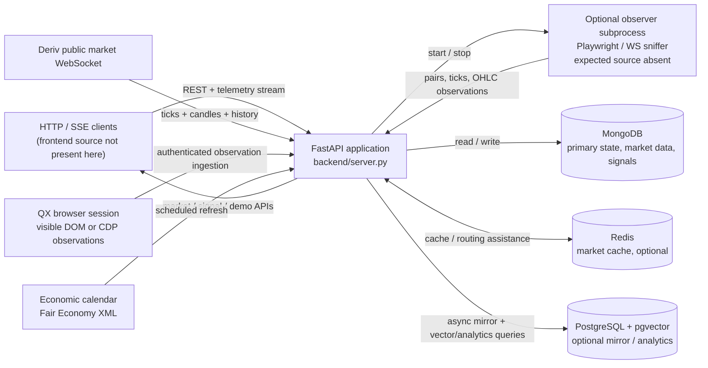
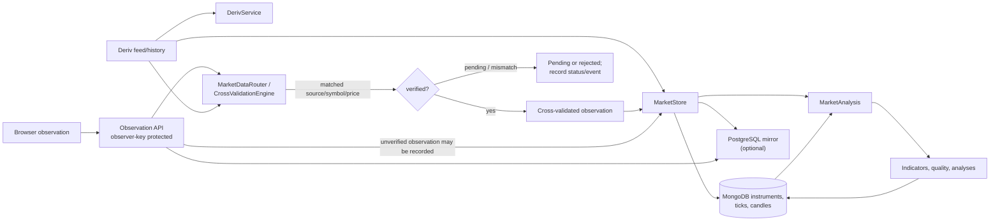
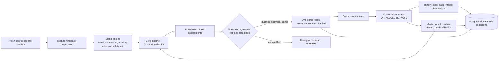

# NAQSO project architecture

This document maps the source and runtime boundaries found in this workspace. The runnable application source is in `master-Candel-v9-main/backend`; the repository-root `README.md` currently contains only the project title.

> **Scope and completeness note:** This map covers backend source, tests, runtime configuration, and the integrations visible in code. No frontend source files or runnable extension/provider source files were present in the workspace inventory. `ProviderController` expects an observer script at `master-Candel-v9-main/extensions/market-qx-observer-v2/playwright/playwright_observer.py`; that file was not present. Generated frontend output, `node_modules`, Python virtual environments, bytecode, and local environment/secret file contents are intentionally excluded. A frontend client or observer extension may exist outside this checkout.

## 1. System context and runtime containers

MongoDB is the primary store. PostgreSQL is an optional secondary service; a missing or unavailable PostgreSQL connection does not replace MongoDB or prevent the intended startup flow. Redis is used by the market cache layer. These services are configured at runtime; connection values are not documented here.

## 2. Backend component map

```mermaid
flowchart TB
    subgraph API["HTTP surface — FastAPI routers"]
        MR["market_routes.py<br/>/api/v1 market, status, analysis"]
        OR["observation_routes.py<br/>/api/v1/observation"]
        SR["signal_routes.py<br/>/api/v1/signals"]
        DR["demo_routes.py<br/>/api/v1/demo"]
        PR["postgres_routes.py<br/>/api/v1/postgres"]
        ML["ml_model_adapters.py<br/>/api/v1/ml"]
        TR["telemetry_routes.py<br/>/api/telemetry/stream"]
        PCR["provider_control.py<br/>/api/v1/providers"]
        XR["extension_download.py<br/>/api/v1/observer/download"]
    end

    subgraph Ingest["Market ingestion and storage"]
        DS["deriv_service.py<br/>websocket, reconnect, history"]
        G["market_gatekeeper.py<br/>cache, cross-validation,<br/>routing, worker pool"]
        MS["market_store.py<br/>instruments, ticks, candles,<br/>events, Mongo indexes"]
        AS["market_analysis.py<br/>indicators and scheduled analysis"]
    end

    subgraph Signals["Signal, model, and learning services"]
        SS["signal_service.py<br/>signal lifecycle, scans,<br/>settlement and statistics"]
        CE["signal_engine.py<br/>votes, safety veto, qualification,<br/>outcome labels"]
        CP["core_pipeline.py<br/>shared multi-stage assessment"]
        FC["forecasting/*<br/>time series, timeframe, confluence,<br/>market filter, risk, blueprint"]
        FE["feature_engineering.py<br/>indicators and feature sequences"]
        MA["market_agent_registry.py<br/>market behaviour / agent state"]
        MO["market_ml_orchestrator.py<br/>features + behaviour + registry"]
        AD["ml_model_adapters.py<br/>model adapters and API"]
        DM["deep_model_service.py<br/>training, inference, model registry"]
        MF["ensemble_fusion.py<br/>model fusion"]
        MAgent["master_agent.py<br/>qualified candidate ranking<br/>and learned weights"]
        SRCH["signal_research.py +<br/>signal_calibration.py<br/>walk-forward research and calibration"]
        EC["economic_calendar.py<br/>scheduled event context"]
    end

    subgraph Persistence["Persistence and controls"]
        Mongo[("MongoDB primary")]
        Redis[("Redis optional")]
        PG["postgres_service.py<br/>PostgreSQL optional mirror,<br/>retention, analytics, vectors"]
        Auth["market_auth.py<br/>observer/operator key checks"]
        Config["market_config.py +<br/>pairs_config.py<br/>environment and market settings"]
    end

    DS --> G
    OR --> Auth
    OR --> G
    G --> MS
    DS --> MS
    MS --> Mongo
    G <--> Redis
    MS --> PG
    OR --> PG
    MS --> AS
    MR --> MS
    MR --> AS
    SR --> SS
    SS --> MS
    SS --> CE
    SS --> CP
    CP --> CE
    CP --> FC
    SS --> FE
    FE --> MO
    MO --> MA
    SS --> AD
    SS --> DM
    SS --> MF
    SS --> MAgent
    SS --> SRCH
    SS --> EC
    SS --> Mongo
    DM --> Mongo
    MAgent --> Mongo
    PR --> PG
    ML --> AD
    ML --> DM
    TR --> MS
    TR --> SS
    TR --> PG
    PCR --> DS
    PCR --> Auth
    Config -. "settings" .-> DS
    Config -. "settings" .-> SS
    DR --> Mongo
```

The diagram groups tightly coupled implementation modules. The app is assembled in `backend/server.py`; the routers and services are wired there and share service instances rather than running as separate microservices.

## 3. Market data and signal flows

### Ingestion, validation, and analytical path

Observer records include provenance and verification state. OTC observations remain observation-only; real-market QX observations are not treated as validated for analysis until the cross-validation conditions in the backend are satisfied. The market store validates tick freshness/order and candle OHLC values, creates configured timeframe buckets, and expires raw ticks/receipts through MongoDB TTL indexes.

### Signal generation, settlement, and feedback

The code explicitly reports `executionEnabled: false`: signals and the demo ledger are analytical/simulated, not broker order execution. Signal settings, qualification, research, calibration, manual deep scans, live/history/stats, and execution-eligibility reporting are exposed as separate API operations.

## 4. API surface

| Prefix / path | Responsibility |
|---|---|
| `/api/health`, `/api/`, `/api/status` | Health/readiness, service identity, basic status-check records |
| `/api/v1` | Runtime, instruments, observation status, market state, analysis, top pairs, history, events, agents, modules |
| `/api/v1/observation` | Authenticated pair discovery and tick/candle/event ingestion; observer health check |
| `/api/v1/signals` | Live/history/stats, paper-model stats, eligibility, checks, pipeline/master-agent reports, settings, scans, research, calibration |
| `/api/v1/ml` | ML runner status, training, inference |
| `/api/v1/demo` | Simulated session/account/actions/history |
| `/api/v1/postgres` | Mirror status/configuration, analytics, feature-vector similarity |
| `/api/v1/providers` | Provider status and authenticated start/stop controls |
| `/api/telemetry/stream` | Server-sent telemetry stream |
| `/api/v1/observer/download` | Observer/extension package download endpoint |

Concrete route operations found in the router source:

| Router | Methods and paths |
|---|---|
| Core market | `GET /api/v1/runtime`, `/instruments`, `/observation`, `/market/state`, `/analysis/latest`, `/top-pairs`, `/history`, `/events`, `/agents`, `/modules`; `POST /api/v1/analysis` |
| Observation | `GET /api/v1/observation/check`; `POST /api/v1/observation/pairs`, `/tick`, `/event` |
| Signals | `GET /api/v1/signals/live`, `/history`, `/stats`, `/paper-model-stats`, `/execution-eligibility`, `/check`, `/pipeline`, `/master-agent`, `/settings`, `/research`, `/calibration`; `POST /api/v1/signals/settings`, `/scan`, `/calibration/run` |
| ML | `GET /api/v1/ml/status`; `POST /api/v1/ml/train`, `/infer` |
| Demo | `POST /api/v1/demo/session`, `/actions`; `GET /api/v1/demo/account`, `/history` |
| PostgreSQL | `GET /api/v1/postgres/mirror`, `/analytics`; `POST /api/v1/postgres/mirror`, `/vectors/similar` |
| Provider control | `GET /api/v1/providers/status`; `POST /api/v1/providers/{provider}/start`, `/stop` |
| Other | `GET /api/telemetry/stream`, `/api/v1/observer/download` |

The observation router requires the observer key. Signal settings, scans, calibration runs, PostgreSQL mirror changes, and provider start/stop controls have operator-key authorization. CORS origins and accepted headers/methods are configured in `server.py`/`market_config.py`.

## 5. Persistence map

### MongoDB (primary)

| Data group | Collections referenced by backend |
|---|---|
| Market data | `market_instruments`, `market_ticks`, `market_candles`, `market_analyses`, `observer_status`, `observer_receipts` |
| Events and runtime settings | `runtime_events`, `runtime_settings`, `status_checks` |
| Signal lifecycle and research | `live_signals`, `signal_history`, `signal_research_candidates`, `signal_research_runs`, `signal_calibration_runs`, `binary_signal_decisions`, `signal_market_controls`, `calibrations` |
| Models and online learning | `deep_model_registry`, `deep_model_training_runs`, `deep_model_observations`, `deep_model_online_progress`, `model_observations` |
| Agent state and demo | Master-agent state collection, `demo_accounts` |

Mongo indexes are initialized by `MarketStore`, `SignalService`, `MasterAgent`, and `DeepModelService`. Raw ticks and observer receipts have TTL policies; unique compound keys provide deduplication/upsert boundaries for selected records.

### PostgreSQL (optional secondary)

`PostgresService` creates runtime-health, Deriv tick/candle mirror, observer tick/candle, model-prediction, feature-vector, signal-outcome, and deep-model-observation tables. It can enable pgvector-backed similarity search and has a JSONB/non-vector fallback path. Mirror retention and enabled state are configurable and the saved mirror settings are persisted in MongoDB. It is not the authoritative store.

### Redis (optional cache)

`RedisMarketCache` is connected during FastAPI lifespan and closed on shutdown. Market-data routing and agent infrastructure use it as a cache/coordination layer; market records remain in MongoDB.

## 6. Runtime lifecycle and deployment

1. `backend/server.py` loads environment configuration and constructs shared MongoDB, Redis, Deriv, analysis, signal, model, agent, PostgreSQL, and provider-control services.
2. FastAPI lifespan initializes Mongo indexes and model/agent state, connects the cache, restores optional PostgreSQL mirror settings, attempts PostgreSQL/vector initialization, loads signal settings, starts signal and analysis loops, and starts Deriv when enabled.
3. Shutdown stops providers and background work, then closes Redis, PostgreSQL, and MongoDB clients.
4. `backend/Procfile` and `backend/railway.json` both run `uvicorn server:app --host 0.0.0.0 --port $PORT`.
5. Runtime configuration is read from environment variables (including MongoDB, optional PostgreSQL/Redis, Deriv, observer/operator auth, CORS, timeframes, and concurrency). Secret values are deliberately not repeated in this document.

The backend dependency manifest includes FastAPI/Uvicorn and Pydantic for the API, Motor/PyMongo for MongoDB, Redis and asyncpg for optional services, and NumPy/Pandas/scikit-learn/PyTorch/`ta` for analysis and modeling; HTTP/WebSocket clients and dotenv support provider and configuration behavior.

## 7. Source and test map

| Location | Scope |
|---|---|
| `master-Candel-v9-main/backend/server.py` | Application composition, lifespan, health and status endpoints |
| `backend/*_routes.py`, `backend/telemetry_routes.py` | HTTP API routers |
| `backend/market_store.py`, `backend/deriv_service.py`, `backend/market_gatekeeper.py` | Market storage, provider feed, routing/cache/cross-validation |
| `backend/market_analysis.py`, `backend/feature_engineering.py`, `backend/market_behaviour_finder.py`, `backend/market_ml_orchestrator.py` | Technical analysis, feature construction, behaviour and ML orchestration |
| `backend/signal_*.py`, `backend/core_pipeline.py`, `backend/forecasting/` | Signal rules, pipeline, settlement, walk-forward research and calibration |
| `backend/ml_model_adapters.py`, `backend/deep_model_service.py`, `backend/ensemble_fusion.py`, `backend/master_agent.py` | Model adapters, deep models, fusion and adaptive candidate ranking |
| `backend/postgres_service.py`, `backend/market_auth.py`, `backend/market_config.py`, `backend/pairs_config.py` | Secondary persistence, authorization and configuration |
| `backend/demo_engine.py`, `backend/demo_catalog.json` | Simulated account/trade behavior and demo catalog |
| `backend/configure_extension.py`, `backend/extension_download.py`, `backend/provider_control.py` | Extension setup/download and provider process controls |
| `backend/tests/` | Unit/integration tests for backend, provider retry/control, auth, signal engine/research/calibration, deep models, demo ledger, PostgreSQL vectors and market gatekeeping |

The tracked project has no frontend package manifest or frontend application source in this checkout. The `frontend` directory contains generated/dependency output, which is not an authoritative source tree and is not included in the architecture map.

## 8. Important boundaries and items to verify in deployment

- Provide the external observer implementation expected by `ProviderController` before enabling `ws_sniffer` or `playwright_observer`; otherwise provider start reports `OBSERVER_SCRIPT_NOT_FOUND`.
- Supply required runtime environment configuration through the deployment secret manager. This document intentionally includes no values from `.env` or other secret files.
- MongoDB is required by the app construction (`MONGO_URL` and `DB_NAME`); PostgreSQL, Redis, Deriv feed and observer are configured/optional features to verify against the target deployment.
- No checked-in frontend source means API consumer behavior and UI routes cannot be mapped from this checkout.
- Treat observer data according to its persisted provenance/verification status; browser receipt alone is not equivalent to provider cross-validation.
- Analytical predictions, learned scores and the demo ledger do not place live trades; backend health/runtime responses keep execution disabled.
